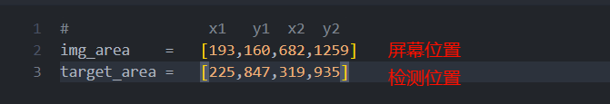
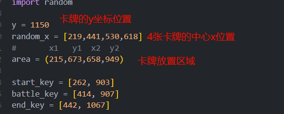

# 皇室战争卡牌大师脚本配置

## 1、投屏软件

推荐windows 自带的手机连接，但是有些手机不能用，或者需要科学上网。

可以使用其他平替软件，只要可以通过电脑操作手机即可


## 2、准备环境

你的环境需要有如下包

cv2 numpy keyboard pyautogui

```
pip install opencv-python numpy keyboard pyautogui -i https://mirrors.tuna.tsinghua.edu.cn/pypi/web/simple
```

## 3、运行

你需要更改一些参数，在main.ipynb的前面，和Running部分

- 先确定你的屏幕所在位置




